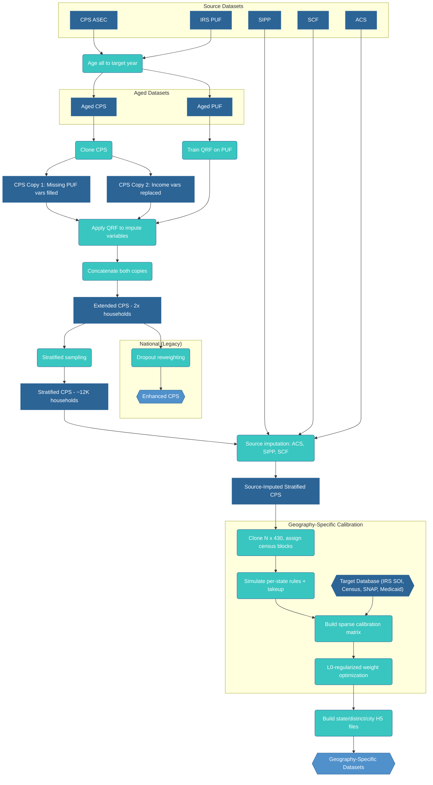

# Methodology

PolicyEngine constructs its representative household dataset through a multi-stage pipeline. Survey data from the CPS is merged with tax detail from the IRS PUF, stratified, and supplemented with variables from ACS, SIPP, and SCF. The resulting dataset is then cloned to geographic variants, simulated through PolicyEngine US with stochastic take-up, and calibrated via L0-regularized optimization against administrative targets at the national, state, and congressional district levels. The pipeline produces 488 geographically representative H5 datasets.

## Stage 1: Variable Imputation

The imputation process begins by aging both the CPS and PUF datasets to the target year, then creating a copy of the aged CPS dataset. This allows us to preserve the original CPS structure while adding imputed tax variables.

### Data Aging

We age all datasets (CPS, PUF, SIPP, SCF, and ACS) to the target year using population growth factors and income growth indices for input variables only.

We strip out calculated values like taxes and benefits from the source datasets. We recalculate these only after assembling all inputs.

This ensures that the imputation models are trained and applied on contemporaneous data.

### Data Cloning Approach

We clone the aged CPS dataset to create two versions. The first copy retains original CPS values but fills in variables that don't exist in CPS with imputed values from the PUF, such as mortgage interest deduction and charitable contributions. The second copy replaces existing CPS income variables with imputed values from the PUF, including wages and salaries, self-employment income, and partnership/S-corp income.

This dual approach ensures that variables not collected in CPS are added from the PUF, while variables collected in CPS but with measurement error are replaced with more accurate PUF values. Most importantly, household structure and relationships are preserved in both copies.

### Quantile Random Forests

Quantile Random Forests (QRF) is an extension of random forests that estimates conditional quantiles rather than conditional means. QRF builds an ensemble of decision trees on the training data and stores all observations in leaf nodes rather than just their means. This enables estimation of any quantile of the conditional distribution at prediction time.

#### QRF Sampling Process

The key innovation of QRF for imputation is the ability to sample from the conditional distribution rather than using point estimates. The process works as follows:

1. **Train the model**: QRF estimates multiple conditional quantiles (e.g., 10 quantiles from 0 to 1)
2. **Generate random quantiles**: For each CPS record, draw a random quantile from a Beta distribution
3. **Select imputed value**: Use the randomly selected quantile to extract a value from the conditional distribution

This approach preserves realistic variation and captures conditional tails. For example, a young worker might have low wages most of the time but occasionally have high wages. QRF captures this by allowing the imputation to sometimes draw from the upper tail of the conditional distribution, thus maintaining realistic inequality within demographic groups.

### Implementation

The implementation uses the `quantile-forest` package, which provides scikit-learn compatible QRF implementation. The aged PUF is subsampled for training efficiency.

### Predictor Variables

Both imputations use the same seven demographic variables available in both datasets: age of the person, gender indicator, tax unit filing status (joint or separate), number of dependents in the tax unit, and tax unit role indicators (head, spouse, or dependent).

These demographic predictors capture key determinants of income and tax variables while being reliably measured in both datasets.

### Imputed Variables

The process imputes tax-related variables from the PUF in two ways:

For CPS Copy 1, we add variables that are missing in CPS, including mortgage interest deduction, charitable contributions (both cash and non-cash), state and local tax deductions, medical expense deductions, and foreign tax credit. We also impute various tax credits such as child care, education, and energy credits, along with capital gains (both short and long term), dividend income (qualified and non-qualified), and other itemized deductions and adjustments.

For CPS Copy 2, we replace existing CPS income variables with more accurate PUF values, including partnership and S-corp income, interest deduction, unreimbursed business employee expenses, pre-tax contributions, W-2 wages from qualified business, self-employed pension contributions, and charitable cash donations.

We concatenate these two CPS copies to create the Extended CPS, effectively doubling the dataset size.

### Additional Imputations

Beyond PUF tax variables, we impute variables from three other data sources:

From the Survey of Income and Program Participation (SIPP), we impute tip income using predictors including employment income, age, number of children under 18, and number of children under 6.

From the Survey of Consumer Finances (SCF), we match auto loan balances based on household demographics and income, then calculate interest on auto loans from these imputed balances. We also impute various net worth components and wealth measures not available in CPS.

From the American Community Survey (ACS), we impute property taxes for homeowners based on state of residence, household income, and demographic characteristics. We also impute rent values for specific tenure types where CPS data is incomplete, along with additional housing-related variables.

### Example: Tip Income Imputation

To illustrate how QRF preserves conditional distributions, consider tip income imputation. The training data from SIPP contains workers with employment income and tip income.

For a worker with the following characteristics:
- Employment income: \$30,000
- Age: 25
- Number of children: 0

QRF finds that similar workers in SIPP have a conditional distribution of tip income:
- 10th percentile: \$0 (no tips)
- 50th percentile: \$2,000
- 90th percentile: \$8,000
- 99th percentile: \$15,000

If the random quantile drawn is 0.85, the imputed tip income would be approximately \$6,500. This approach ensures that some similar workers receive no tips while others receive substantial tips, preserving realistic variation.

## Stage 2: Stratification and Source Imputation

After creating the Extended CPS, we reduce and enrich the dataset before calibration.

### Stratified Sampling

The Extended CPS contains roughly 400K person records after the PUF cloning step. Running full microsimulation on every clone of this dataset would be prohibitively expensive. We apply stratified sampling to reduce the dataset to approximately 12,000 households while preserving the tails of the income distribution.

The stratification works in two steps. First, all households above the 99.5th percentile of adjusted gross income are retained unconditionally — this preserves the top 1% of the AGI distribution, which contributes disproportionately to tax revenue and is difficult to reconstruct from a uniform sample. Second, from the remaining households, we draw a uniform random sample to reach the target size. Weights are adjusted proportionally so that the stratified dataset still represents the full population.

### Source Imputation

We then impute additional variables from three supplementary surveys onto the stratified CPS. These imputations use quantile regression forests with state of residence as a predictor, which allows the imputed values to reflect geographic variation.

**ACS (American Community Survey)**: Rent, real estate taxes. State is included as a predictor, which is important because property tax rates and rent levels vary substantially across states.

**SIPP (Survey of Income and Program Participation)**: Tip income, bank account assets, stock assets, bond assets. These financial variables are not available in CPS and are imputed from SIPP's more detailed wealth module.

**SCF (Survey of Consumer Finances)**: Net worth, auto loan balances, auto loan interest. SCF provides the most comprehensive household balance sheet data among US surveys.

The output of this stage is the source-imputed stratified CPS (`source_imputed_stratified_extended_cps_2024.h5`), which serves as the input to the geography-specific calibration pipeline.

## Stage 3: Geography-Specific Calibration

The calibration stage adjusts household weights so that the dataset matches administrative totals at the national, state, and congressional district levels simultaneously. This is the core innovation of the pipeline: rather than calibrating a single national dataset, we create geographic variants of each household and optimize a single weight vector over all variants jointly.

### Clone-Based Geography Assignment

Each household in the stratified CPS is cloned 430 times. Each clone is assigned a random census block drawn from a population-weighted distribution of all US census blocks. The block GEOID (a 15-character identifier in the format SSCCCTTTTTTBBBB) determines all higher-level geography: state, county, congressional district, tract, and other areas.

This approach means that the same household appears in many different states and districts, but with different weights. The optimizer can then increase the weight of a clone in states where that household's characteristics are needed and decrease it elsewhere.

### Per-State Simulation

For each clone, we simulate tax liabilities and benefit eligibility under the state rules corresponding to the clone's assigned geography. This is done clone-by-clone (equivalently, state-by-state): for each of the 51 state jurisdictions, we set every record's state FIPS to that state, run a full PolicyEngine US microsimulation, and extract the calculated variables.

Benefit takeup is re-randomized per clone using block-level seeded random number generation. This ensures that takeup draws are deterministic given the geography assignment but vary across clones, reflecting the real-world variation in program participation.

### Calibration Matrix

The simulation results are assembled into a sparse calibration matrix of shape (n_targets, n_clones × n_records). Each row represents a calibration target (e.g., "total SNAP benefits in California"), and each column represents one clone of one household. The matrix entry is the household's contribution to that target — for example, the SNAP benefit amount for a household assigned to California.

Geographic masking ensures that each target only involves the clones assigned to the relevant geography. A California SNAP target has nonzero entries only for clones whose census block falls in California. This makes the matrix very sparse: each target involves only a small fraction of all clones.

### Target Database

Calibration targets are stored in a SQLite database (`policy_data.db`) built from administrative sources:

**IRS SOI**: Income by AGI bracket and filing status, return counts, aggregate income by source, deduction and credit utilization — at both national and state levels.

**Census ACS**: Population by single year of age, state and district total populations.

**USDA FNS SNAP**: Participation counts and benefit totals by state.

**CMS Medicaid**: Enrollment by state.

**Census STC**: Revenue by state from state tax agencies.

**[CDC VSRR](data.cdc.gov/resource/hmz2-vwda)**: State-level birth and pregnancy counts.

The database is built via ETL scripts (`policyengine_us_data/db/`) that download, transform, and load each source.

### Hierarchical Uprating

Some targets are available at the state level but not at the congressional district level, or vice versa. Hierarchical uprating reconciles these using two factors:

The **hierarchy inconsistency factor (HIF)** adjusts district-level estimates so they sum to the known state total. If the sum of district estimates for a variable exceeds the state total, HIF scales them down proportionally.

**State-specific uprating factors** adjust variables that depend on state-level policy parameters. For example, ACA premium tax credits depend on state-specific benchmark premiums from CMS and KFF data, so the uprating factor for PTC varies by state.

### L0-Regularized Optimization

The optimization finds a weight vector **w** such that the matrix-vector product **X · w** approximates the target vector **t**. The loss function minimizes the mean squared relative error between achieved and target values.

L0 regularization encourages sparsity in the weight vector — pushing many clone weights to exactly zero. This is implemented via Hard Concrete gates {cite}`louizos2018learning`, a continuous relaxation of the L0 norm that is differentiable and compatible with gradient-based optimization. Each weight has an associated gate parameter; during training, gates are sampled from a stretched Hard Concrete distribution and thresholded to produce exact zeros.

Two presets control the degree of sparsity:

- **Local preset** (λ_L0 = 1e-8): Retains 3–4 million records with nonzero weight. Used for building state and district H5 files where geographic detail matters.
- **National preset** (λ_L0 = 1e-4): Retains approximately 50,000 records. Used for the national web app dataset where fast computation is prioritized over geographic granularity.

The optimizer is Adam with a learning rate of 0.15, running for 100–200 epochs. Training runs on GPU (A100 or T4) via Modal for production builds, or on CPU for local development.

## Stage 4: Local Area Dataset Generation

Calibrated weights are converted into geography-specific H5 datasets — one per state, congressional district, and city.

### Subsetting by Geography

For each target area (e.g., the state of California or congressional district NY-14), the builder selects the subset of clones whose assigned congressional district falls within that area. It filters the clone-level weight vector to only those clones and constructs an H5 file containing the corresponding household records with their calibrated weights.

For city datasets, an additional county-level probability filter scales weights by the fraction of the city's population in each county, since cities may span multiple congressional districts.

### Block-Level Geography Derivation

Each record in the output H5 inherits its geographic variables from the census block assigned during cloning. The 15-character block GEOID determines state FIPS, county FIPS, tract, and — via crosswalk tables — CBSA, state legislative districts, place, PUMA, and ZCTA. This ensures geographic consistency: a record assigned to a block in Queens County will have the correct state (NY), county, congressional district, and city codes.

### SPM Threshold Recalculation

Supplemental Poverty Measure thresholds vary by housing tenure and metropolitan area. After geography assignment, SPM thresholds are recalculated for each record based on its assigned block's metro area, ensuring that poverty status reflects local cost of living.

### Output

The pipeline produces 488 H5 datasets: 51 state files (including DC), 435 congressional district files, a national file, and city files for New York City. Each file is a self-contained PolicyEngine dataset that can be loaded directly into `Microsimulation` for policy analysis.

## Validation

We validate the pipeline at multiple stages. Imputation quality is checked via out-of-sample prediction on held-out records from source datasets. Calibration quality is measured by comparing achieved target values (**X · w**) against administrative totals, reported as relative error per target. The validation script (`validate_staging`) computes these metrics across all state and district H5 files, flagging any area where relative error exceeds acceptable thresholds.

Structural integrity checks verify that weights are positive, that household structures remain intact (all members of a household receive the same weight), and that state populations sum to the national total.

## Implementation

The implementation is available at:
[https://github.com/PolicyEngine/policyengine-us-data](https://github.com/PolicyEngine/policyengine-us-data)

Key files:
- `policyengine_us_data/datasets/cps/extended_cps.py` — PUF imputation onto CPS
- `policyengine_us_data/calibration/create_stratified_cps.py` — Stratified sampling
- `policyengine_us_data/calibration/create_source_imputed_cps.py` — ACS/SIPP/SCF source imputation
- `policyengine_us_data/calibration/unified_calibration.py` — L0 calibration orchestrator
- `policyengine_us_data/calibration/unified_matrix_builder.py` — Sparse calibration matrix builder
- `policyengine_us_data/calibration/clone_and_assign.py` — Geography cloning and block assignment
- `policyengine_us_data/calibration/publish_local_area.py` — H5 file generation
- `policyengine_us_data/db/` — Target database ETL scripts