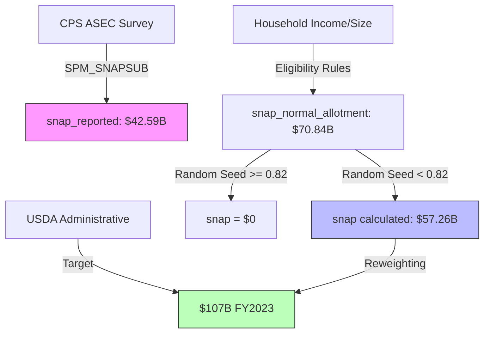

# SNAP Simulation Analysis

## Overview

This document analyzes the relationship between `snap_reported` (CPS survey data) and `snap` (calculated) in PolicyEngine's CPS 2023 dataset. The analysis reveals critical differences between survey-reported benefits and rule-based calculations.

## Key Findings

### Two Independent SNAP Variables

PolicyEngine maintains two separate SNAP variables that operate independently:

**snap_reported** ($42.59B):
- Source: CPS ASEC survey responses (`SPM_SNAPSUB`)
- Represents what households reported receiving in surveys
- Known underreporting: ~40% of administrative totals
- Loaded in: `policyengine_us_data/datasets/cps/cps.py:609-630`

**snap** ($57.26B calculated):
- Calculated independently using federal eligibility rules
- Does not reference `snap_reported` values
- Calculation flow: Eligibility rules → $70.84B → Apply 82% take-up → $57.26B
- Target: $107B (USDA FY2023 administrative data)

### The Take-up Mechanism

**Purpose**: Models the empirical observation that ~82% of eligible households claim SNAP benefits.

**Implementation**:
```python
# policyengine_us_data/datasets/cps/cps.py:219
generator = np.random.default_rng(seed=100)
data["snap_take_up_seed"] = generator.random(len(data["spm_unit_id"]))

# policyengine_us/variables/gov/usda/snap/takes_up_snap_if_eligible.py
def formula(spm_unit, period, parameters):
    seed = spm_unit("snap_take_up_seed", period)
    takeup_rate = parameters(period).gov.usda.snap.takeup_rate  # 0.82
    return seed < takeup_rate
```

**Effect**: Reduces calculated benefits from $70.84B to $57.26B (19.2% reduction)

### Critical Problems Identified

#### Problem A: Actual Recipients Zeroed Out

**$25.89B in reported SNAP benefits are set to $0:**

| Reason | SPM Units | Amount | Explanation |
|--------|-----------|--------|-------------|
| Deemed ineligible | 7.3M | $21.52B | Rules say they don't qualify, but they actually receive SNAP |
| Failed take-up seed | 1.2M | $4.31B | Eligible but random seed ≥ 0.82 |

**Example case**:
- Household reports $276/year SNAP
- Eligible for $264/year calculated
- But `snap_take_up_seed = 0.861 > 0.82`
- Result: `snap = $0`

**The take-up mechanism applies to ALL households, including those who reported receiving benefits.**

#### Problem B: Eligibility Rules Don't Match Reality

**7.7M SPM units actually receiving SNAP are deemed "ineligible" by PolicyEngine.**

Evidence from sample analysis:

| SPM Unit | Reported SNAP | Calculated | Gross Income | 130% FPL Limit | Status |
|----------|--------------|------------|--------------|----------------|---------|
| 7 | $5,160/year | $0 | $5,000/mo | $2,693/mo | 186% over limit |
| 43 | $276/year | $0 | $1,973/mo | $2,136/mo | 92% of limit |
| 78 | $3,492/year | $0 | $0/mo | $1,580/mo | 0% income but still ineligible |

**Root causes**:

1. **Broad-Based Categorical Eligibility (BBCE)** not modeled
   - 40+ states use BBCE
   - Recipients of any TANF-funded service are categorically eligible
   - Income limits waived or raised to 185-200% FPL

2. **State-specific variations** not captured
   - Different income limits by state
   - Varying asset tests (often waived)
   - State supplements

3. **Income comparison**:
   - "Ineligible" recipients: Mean income $4,600/month
   - "Eligible" units: Mean income $1,668/month
   - Ratio: 2.8x higher income among actual recipients

**PolicyEngine uses federal baseline rules, missing state-level expansions that cover millions of real recipients.**

#### Problem C: Poor Household-Level Matching

Overlap analysis between reported and calculated SNAP:

| Category | Count | Notes |
|----------|-------|-------|
| Both reported AND calculated | 5.2M | Correlation: 0.55 between amounts |
| Reported but NOT calculated | 8.5M | Actual recipients zeroed out |
| Calculated but NOT reported | 11.6M | Survey underreporting |
| Neither | 107.1M | |

**Only 37% of actual recipients (5.2M / 14M) are correctly identified, with weak correlation in benefit amounts.**

## Why snap > snap_reported

Despite the 82% take-up reducing calculated benefits by 19%, `snap` ($57.26B) is still 34% higher than `snap_reported` ($42.59B):

1. **Starting point is higher**: Eligibility rules produce $70.84B before take-up
2. **Calculated entitlements exceed reports**: Rules-based calculation captures "proper" benefit amounts while surveys are imprecise
3. **Survey underreporting is severe**: Known issue in CPS ASEC data
4. **Emergency allotments included**: Jan-Feb 2023 had COVID-era supplements ($4.46B/month)

The 19% reduction from take-up is smaller than the 66% increase from calculated entitlements over reported benefits.

## Data Flow



## Implications

### For Analysis

1. **snap_reported** and **snap** are not comparable - they represent fundamentally different measurements
2. **Individual household accuracy is poor** - only 37% match, correlation 0.55
3. **Aggregate totals require calibration** - raw calculations underestimate by 47% ($57B vs $107B target)

### For Policy Simulation

**Advantages**:
- Consistent methodology for policy reforms
- Can model eligibility rule changes
- Not anchored to survey underreporting

**Disadvantages**:
- Destroys empirical information from actual recipients
- Misses state-level program variations
- Household-level predictions unreliable

### For Calibration

The Enhanced CPS reweighting process must bridge a large gap:
- Starting point: $57.26B (raw calculated)
- Target: $107B (administrative)
- Required adjustment: 87% increase via household weights

This heavy reliance on calibration suggests the base eligibility calculations need improvement.

## Recommendations for Future Work

1. **Preserve reported information**: Don't zero out households that report receiving SNAP
   ```python
   # Proposed logic
   if snap_reported > 0:
       return max(snap_reported, calculated_value)
   else:
       return calculated_value * takes_up
   ```

2. **Model state-level SNAP variations**: Implement BBCE and state-specific rules

3. **Investigate eligibility rule accuracy**: Why do 7.7M actual recipients fail eligibility?

4. **Consider conditional take-up**: Apply take-up only to households without reported benefits

5. **Document limitations**: Make clear that household-level SNAP predictions are unreliable

## Technical Details

### Files Analyzed

- Data: `policyengine-us-data/datasets/cps/cps.py`
- Calculation: `policyengine-us/variables/gov/usda/snap/snap.py`
- Take-up: `policyengine-us/variables/gov/usda/snap/takes_up_snap_if_eligible.py`
- Parameter: `policyengine-us/parameters/gov/usda/snap/takeup_rate.yaml`
- Calibration targets: `policyengine-us-data/db/etl_snap.py`

### Dataset Information

- Analysis date: 2025-01-13
- Dataset: `cps_2023.h5` (uncalibrated)
- Total SPM units: 21,533
- Reported SNAP recipients: 14.0M weighted
- Calculated SNAP recipients: 18.4M weighted

## Conclusion

The SNAP simulation in PolicyEngine is a **complete re-calculation that ignores reported survey values**. This approach prioritizes policy simulation consistency over empirical accuracy at the household level. The take-up mechanism reduces calculated benefits but does not bridge `snap_reported` to `snap` - they remain independent estimates representing different measurement approaches (survey vs. rules-based).

The system relies heavily on subsequent calibration to match administrative totals, with household-level predictions showing poor accuracy (37% overlap, 0.55 correlation). Real SNAP recipients are frequently zeroed out, either due to incomplete state rule modeling ($21.52B) or random take-up exclusion ($4.31B).
