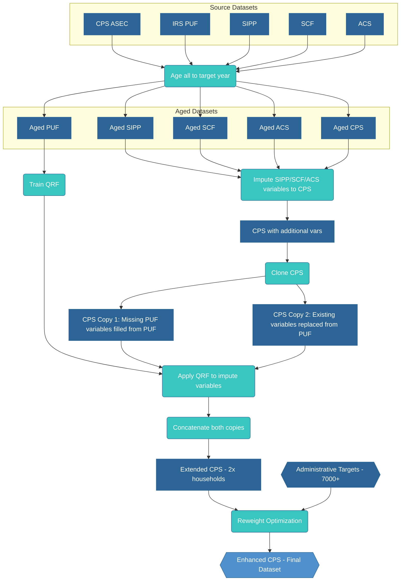

# Methodology

The Enhanced CPS dataset is created through a two-stage process: imputation followed by reweighting. The imputation stage creates a copy of the CPS and uses Quantile Regression Forests to impute tax variables from the PUF onto this copy, creating the Extended CPS. The reweighting stage then optimizes household weights to match administrative targets, producing the Enhanced CPS with weights calibrated to statistics.

## Stage 1: Variable Imputation

The imputation process begins by aging both the CPS and PUF datasets to the target year, then creating a copy of the aged CPS dataset. This allows us to preserve the original CPS structure while adding imputed tax variables.

### Data Aging

All datasets (CPS, PUF, SIPP, SCF, and ACS) are aged to the target year using:
- Population growth factors
- Income growth indices for input variables only

Calculated values like taxes and benefits from the source datasets are stripped out. These are recalculated only after all inputs have been assembled.

This ensures that the imputation models are trained and applied on contemporaneous data.

### Data Cloning Approach

The aged CPS dataset is cloned to create two versions:

1. **CPS Copy 1 - Missing Variables**: Retains original CPS values but fills in variables that don't exist in CPS with imputed values from the PUF (e.g., mortgage interest deduction, charitable contributions)

2. **CPS Copy 2 - Replaced Variables**: Replaces existing CPS income variables with imputed values from the PUF (e.g., wages and salaries, self-employment income, partnership/S-corp income)

This dual approach ensures:
- Variables not collected in CPS are added from the PUF
- Variables collected in CPS but with measurement error are replaced with more accurate PUF values
- Household structure and relationships are preserved in both copies

### Quantile Regression Forests

Quantile Regression Forests (QRF) is an extension of random forests that estimates conditional quantiles rather than conditional means. QRF builds an ensemble of decision trees on the training data and stores all observations in leaf nodes rather than just their means. This enables estimation of any quantile of the conditional distribution at prediction time.

#### QRF Sampling Process

The key innovation of QRF for imputation is the ability to sample from the conditional distribution rather than using point estimates. The process works as follows:

1. **Train the model**: QRF estimates multiple conditional quantiles (e.g., 10 quantiles from 0 to 1)
2. **Generate random quantiles**: For each CPS record, draw a random quantile from a Beta distribution
3. **Select imputed value**: Use the randomly selected quantile to extract a value from the conditional distribution

This approach preserves realistic variation and captures conditional tails. For example:
- A young worker might have low wages most of the time but occasionally have high wages
- QRF captures this by allowing the imputation to sometimes draw from the upper tail of the conditional distribution
- This maintains realistic inequality within demographic groups

### Implementation

The implementation uses the `quantile-forest` package, which provides scikit-learn compatible QRF implementation. The aged PUF is subsampled for training efficiency.

### Predictor Variables

Both imputations use the same seven demographic variables available in both datasets:
- Age of the person
- Gender indicator
- Tax unit filing status (joint or separate)
- Number of dependents in the tax unit
- Tax unit role indicators (head, spouse, or dependent)

These demographic predictors capture key determinants of income and tax variables while being reliably measured in both datasets.

### Imputed Variables

The process imputes tax-related variables from the PUF in two ways:

**Variables added to CPS Copy 1 (missing in CPS)**:
- Mortgage interest deduction
- Charitable contributions (cash and non-cash)
- State and local tax deductions
- Medical expense deductions
- Foreign tax credit
- Various tax credits (child care, education, energy)
- Capital gains (short and long term)
- Dividend income (qualified and non-qualified)
- Other itemized deductions and adjustments

**Variables replaced in CPS Copy 2 (existing in CPS)**:
- Partnership and S-corp income
- Interest deduction
- Unreimbursed business employee expenses
- Pre-tax contributions
- W-2 wages from qualified business
- Self-employed pension contributions
- Charitable cash donations

The concatenation of these two CPS copies creates the Extended CPS, effectively doubling the dataset size.

### Additional Imputations

Beyond PUF tax variables, the process imputes variables from three other data sources:

**SIPP (Survey of Income and Program Participation)**:
- **Tip income**: Imputed using predictors:
  - Employment income
  - Age
  - Number of children under 18
  - Number of children under 6

**SCF (Survey of Consumer Finances)**:
- **Auto loan balances**: Matched based on household demographics and income
- **Interest on auto loans**: Calculated from imputed balances
- **Net worth components**: Various wealth measures not available in CPS

**ACS (American Community Survey)**:
- **Property taxes**: For homeowners, imputed based on:
  - State of residence
  - Household income
  - Demographic characteristics
- **Rent values**: For specific tenure types where CPS data is incomplete
- **Housing characteristics**: Additional housing-related variables

### Example: Tip Income Imputation

To illustrate how QRF preserves conditional distributions, consider tip income imputation:

1. **Training data**: SIPP contains workers with employment income and tip income
2. **Predictors**: Employment income=$30,000, age=25, no children
3. **Conditional distribution**: QRF finds that similar workers in SIPP have:
   - 10th percentile: $0 (no tips)
   - 50th percentile: $2,000 
   - 90th percentile: $8,000
   - 99th percentile: $15,000
4. **Random draw**: If the random quantile is 0.85, the imputed tip income would be approximately $6,500
5. **Result**: Some similar workers get no tips, others get substantial tips, preserving realistic variation

## Stage 2: Reweighting

### Problem Formulation

The reweighting stage adjusts household weights to ensure the enhanced dataset matches administrative totals. Given a loss matrix containing households' contributions to targets, and a target vector of statistics, the process optimizes log-transformed weights to minimize mean squared relative error. The log transformation ensures positive weights while allowing unconstrained optimization.

### Optimization

PyTorch is used for gradient-based optimization with the Adam optimizer. The implementation uses log-transformed weights to ensure positivity constraints are satisfied throughout the optimization process.

### Dropout Regularization

To prevent overfitting to calibration targets, dropout is applied during optimization. Weights are randomly masked each iteration and replaced with the mean of unmasked weights. This helps ensure that no single household receives excessive weight in matching targets.

### Calibration Targets

The loss matrix includes targets from six sources:

**IRS SOI**: Income by AGI bracket and filing status, counts of returns by category, aggregate income totals by source, deduction and credit utilization rates

**Census**: Population by single year of age, state total populations, demographic distributions

**CBO/Treasury**: SNAP participation and benefits, SSI recipient counts, EITC claims by family size, total federal revenues

**JCT**: State and local taxes, charitable contributions, mortgage interest, medical expenses

**Healthcare**: Health insurance premiums, Medicare Part B premiums, medical expenses by age

**Other**: State program participation, income distributions by geography, local area statistics

### Tax and Benefit Calculations

The calibration process incorporates tax and benefit calculations through PolicyEngine's microsimulation capabilities. This ensures that the reweighted dataset reflects income distributions and the interactions between tax liabilities and benefit eligibility.

### Convergence

The optimization converges within iterations. Convergence is monitored through the loss value trajectory, weight stability across iterations, and target achievement rates.

## Validation

### Cross-Validation

The methodology is validated through three approaches: cross-validation on calibration targets, testing stability across multiple random seeds, and validating imputation quality through out-of-sample prediction on held-out records from source datasets.

### Quality Checks

Quality checks ensure data integrity. Weights remain positive after optimization. Weight magnitudes are checked to ensure no single household receives excessive influence on aggregate statistics. Household structures remain intact, with all members of a household receiving the same weight adjustment factor.

## Implementation

The implementation is available at:
[https://github.com/PolicyEngine/policyengine-us-data](https://github.com/PolicyEngine/policyengine-us-data)

Key files:
- `policyengine_us_data/datasets/cps/extended_cps.py` - Imputation stage
- `policyengine_us_data/datasets/cps/enhanced_cps.py` - Reweighting stage
- `policyengine_us_data/utils/loss.py` - Loss matrix construction