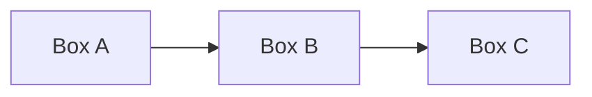
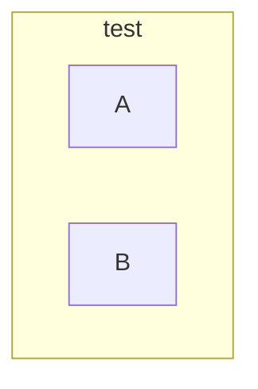

# Simple Mermaid Test

Testing basic Mermaid support:

```mermaid
graph LR
    A[Box A] --> B[Box B]
    B --> C[Box C]
```

Testing with subgraph:

```mermaid
graph TD
    subgraph test
        A[A] 
        B[B]
    end
```