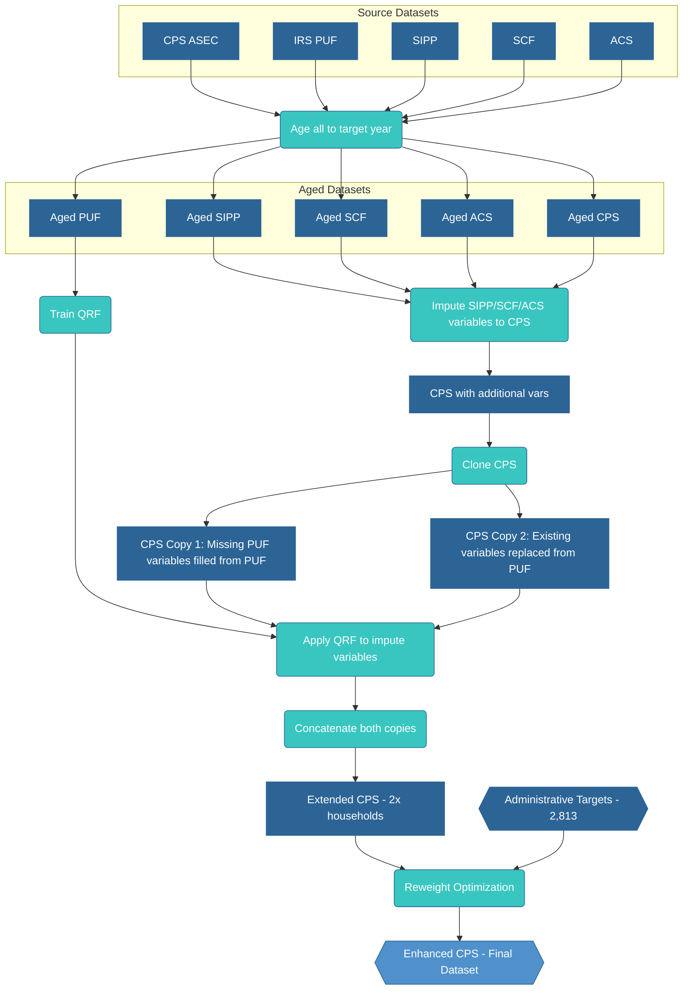

# Methodology

We create the Enhanced CPS dataset through imputation followed by reweighting. The imputation stage creates a copy of the CPS and uses Quantile Regression Forests to impute tax variables from the PUF onto this copy, creating the Extended CPS. The reweighting stage then optimizes household weights to match administrative targets, producing the Enhanced CPS with weights calibrated to statistics.

## Stage 1: Variable Imputation

The imputation process begins by aging both the CPS and PUF datasets to the target year, then creating a copy of the aged CPS dataset. This allows us to preserve the original CPS structure while adding imputed tax variables.

### Data Aging

We age all datasets (CPS, PUF, SIPP, SCF, and ACS) to the target year using population growth factors and income growth indices for input variables only.

We strip out calculated values like taxes and benefits from the source datasets. We recalculate these only after assembling all inputs.

This ensures that the imputation models are trained and applied on contemporaneous data.

### Data Cloning Approach

We clone the aged CPS dataset to create two versions. The first copy retains original CPS values but fills in variables that don't exist in CPS with imputed values from the PUF, such as mortgage interest deduction and charitable contributions. The second copy replaces existing CPS income variables with imputed values from the PUF, including wages and salaries, self-employment income, and partnership/S-corp income.

This dual approach ensures that variables not collected in CPS are added from the PUF, while variables collected in CPS but with measurement error are replaced with more accurate PUF values. Most importantly, household structure and relationships are preserved in both copies.

### Quantile Regression Forests

Quantile Regression Forests (QRF) is an extension of random forests that estimates conditional quantiles rather than conditional means. QRF builds an ensemble of decision trees on the training data and stores all observations in leaf nodes rather than just their means. This enables estimation of any quantile of the conditional distribution at prediction time.

#### QRF Sampling Process

The key innovation of QRF for imputation is the ability to sample from the conditional distribution rather than using point estimates. The process works as follows:

1. **Train the model**: QRF estimates multiple conditional quantiles (e.g., 10 quantiles from 0 to 1)
2. **Generate random quantiles**: For each CPS record, draw a random quantile from a Beta distribution
3. **Select imputed value**: Use the randomly selected quantile to extract a value from the conditional distribution

This approach preserves realistic variation and captures conditional tails. For example, a young worker might have low wages most of the time but occasionally have high wages. QRF captures this by allowing the imputation to sometimes draw from the upper tail of the conditional distribution, thus maintaining realistic inequality within demographic groups.

### Implementation

The implementation uses the `quantile-forest` package, which provides scikit-learn compatible QRF implementation. The aged PUF is subsampled for training efficiency.

### Predictor Variables

Both imputations use the same seven demographic variables available in both datasets: age of the person, gender indicator, tax unit filing status (joint or separate), number of dependents in the tax unit, and tax unit role indicators (head, spouse, or dependent).

These demographic predictors capture key determinants of income and tax variables while being reliably measured in both datasets.

### Imputed Variables

The process imputes tax-related variables from the PUF in two ways:

For CPS Copy 1, we add variables that are missing in CPS, including mortgage interest deduction, charitable contributions (both cash and non-cash), state and local tax deductions, medical expense deductions, and foreign tax credit. We also impute various tax credits such as child care, education, and energy credits, along with capital gains (both short and long term), dividend income (qualified and non-qualified), and other itemized deductions and adjustments.

For CPS Copy 2, we replace existing CPS income variables with more accurate PUF values, including partnership and S-corp income, interest deduction, unreimbursed business employee expenses, pre-tax contributions, W-2 wages from qualified business, self-employed pension contributions, and charitable cash donations.

We concatenate these two CPS copies to create the Extended CPS, effectively doubling the dataset size.

### Additional Imputations

Beyond PUF tax variables, we impute variables from three other data sources:

From the Survey of Income and Program Participation (SIPP), we impute tip income using predictors including employment income, age, number of children under 18, and number of children under 6.

From the Survey of Consumer Finances (SCF), we match auto loan balances based on household demographics and income, then calculate interest on auto loans from these imputed balances. We also impute various net worth components and wealth measures not available in CPS.

From the American Community Survey (ACS), we impute property taxes for homeowners based on state of residence, household income, and demographic characteristics. We also impute rent values for specific tenure types where CPS data is incomplete, along with additional housing-related variables.

### Example: Tip Income Imputation

To illustrate how QRF preserves conditional distributions, consider tip income imputation. The training data from SIPP contains workers with employment income and tip income. For a worker with predictors of $30,000 employment income, age 25, and no children, QRF finds that similar workers in SIPP have a conditional distribution ranging from $0 at the 10th percentile (no tips) to $2,000 at the median, $8,000 at the 90th percentile, and $15,000 at the 99th percentile. If the random quantile drawn is 0.85, the imputed tip income would be approximately $6,500. This approach ensures that some similar workers receive no tips while others receive substantial tips, preserving realistic variation.

## Stage 2: Reweighting

### Problem Formulation

The reweighting stage adjusts household weights to ensure the enhanced dataset matches administrative totals. We optimize log-transformed weights given a loss matrix containing households' contributions to targets and a target vector of statistics to minimize mean squared relative error. The log transformation ensures positive weights while allowing unconstrained optimization.

### Optimization

We use PyTorch for gradient-based optimization with the Adam optimizer. The implementation uses log-transformed weights to ensure positivity constraints are satisfied throughout the optimization process.

### Dropout Regularization

To prevent overfitting to calibration targets, we apply dropout during optimization. We randomly mask weights each iteration and replace them with the mean of unmasked weights. This helps ensure that no single household receives excessive weight in matching targets.

### Calibration Targets

The loss matrix includes targets from six sources:

**IRS SOI**: Income by AGI bracket and filing status, counts of returns by category, aggregate income totals by source, deduction and credit utilization rates

**Census**: Population by single year of age, state total populations, demographic distributions

**CBO/Treasury**: SNAP participation and benefits, SSI recipient counts, EITC claims by family size, total federal revenues

**JCT**: State and local taxes, charitable contributions, mortgage interest, medical expenses

**Healthcare**: Health insurance premiums, Medicare Part B premiums, medical expenses by age

**Other**: State program participation, income distributions by geography, local area statistics

### Tax and Benefit Calculations

The calibration process incorporates tax and benefit calculations through PolicyEngine's microsimulation capabilities. This ensures that the reweighted dataset reflects income distributions and the interactions between tax liabilities and benefit eligibility.

### Convergence

The optimization converges within iterations. We monitor convergence through the loss value trajectory, weight stability across iterations, and target achievement rates.

## Validation

### Cross-Validation

We validate the methodology through three approaches: cross-validation on calibration targets, testing stability across multiple random seeds, and validating imputation quality through out-of-sample prediction on held-out records from source datasets.

### Quality Checks

Quality checks ensure data integrity. Weights remain positive after optimization. We check weight magnitudes to ensure no single household receives excessive influence on aggregate statistics. Household structures remain intact, with all members of a household receiving the same weight adjustment factor.

## Implementation

The implementation is available at:
[https://github.com/PolicyEngine/policyengine-us-data](https://github.com/PolicyEngine/policyengine-us-data)

Key files:
- `policyengine_us_data/datasets/cps/extended_cps.py` - Imputation stage
- `policyengine_us_data/datasets/cps/enhanced_cps.py` - Reweighting stage
- `policyengine_us_data/utils/loss.py` - Loss matrix construction